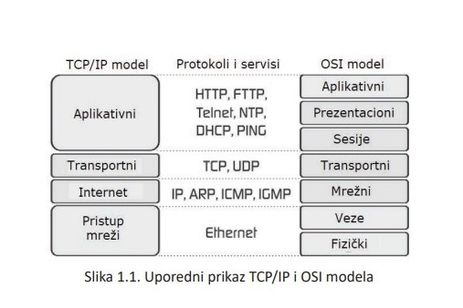

## Racunarska mreza

Racunarska mreza je kolekcija racunara i drugih uredjaja koji mogu medjusobno da salju i primaju podatke u realnom vremenu. Sama fizicka povezanost racunara se moze
postici razlicitim sredstvima, pocev od zicanih kablova, preko optickih kablova, bezicnih veza itd. (hardverska povezanost)

Da bi racunari komunicirali bitno je da postoji ***hardverska*** i ***softverska*** povezanost racunara. Pod softverskom se podrazumjevaju programi u racunarima putem kojih se razmijenjuju podaci. 

Svaki uredjaj u mrezi se naziva ***cvor***. To su uglavno racunari, ali moze biti i ruter, stampac itd. Svaki uredjaj u mrezi koji je potpuno funkcionalan se naziva ***host***. 

Posto je nophodno jednoznacno odrediti svaki racunar u mrezi, njemu se dodjeljuje adresa. 

Sve moderne racunarske mreze se zasnivaju na ***komutaciji paketa***. To znaci da se podaci pre slanja kroz mrezu dijele u manje jedinice koje se nazivaju paketi, pri cemu se svaki paket kroz mrezu slaje nezavisno. Svaki paket nosi informaciju koga je poslao i kuda ide. Posto paketu mogu da putuju razicitim rutama i da stignu u razlicitom redosledu, oni nose brojeve kako bi se mogla rekonstuisati poruka.

Za uspesnu komunikaciju uzmedju racunara neophodan je precizan skup pravila koja definisu kako racunari komuniciraju medjusobno - format adrese, kako se podaci dele u pakete, koji se sigurnosni mehanizmi koriste. Ovaj skup pravila se naziva protokol. Jedan od najznacajnijih protokola je HTTP protokol koji definise nacin komunikacije izmedju veb pretrazivaca i servera.

## Mrezni slojevi

Prenos podataka kroz mrezu je komplikovan proces. Softver koji salje podatke mora znati kako da pretvori digitalne podatke u analogne, izbjegne koalizije izmedju paketa, detektuje i ispravi greske, rutira pojedinacne pakete od jednog hosta do drugog, ispravi pogresan rednosled pristiglih paketa. Kako bi se kompletan proces pojednostavio i drzao pod kontrolom, komunikacija se posmatra kroz slojeve. Razliciti aspekti mreze su podjeljeni po razlicitim nivoima modela. Svaki nivo predstavlja drugaciji nivo apstrakcije sa striktno odredjenom funkcijom. 

Pr. jedan sloj je zaduzen za rutiranje paketa, dok je sloj iznad zaduzen za otkrivanje gresaka i zahtevanje ponovnog slanja ostecenih ili izgubljenih paketa. Svaki sloj direktno komunicira samo sa slojem direktno iznad i slojem direktno ispod njega. 

Postoji nekoliko modela mrezne komunikacije. Referentni model je OSI model koji mrezu dijeli na 7 slojeva. 

U praksi se cesce koristi jednostavniji model koji integrise odredjene slojve. TCP/IP model koji se zasniva na dva osnovna protokola TCP I IP. 

Neki od najbitnijih protokola TCP/IP modela su :

- ***TCP*** - uspostavljanje konekcije, kontrola toka podataka, kontrola rednosleda paketa, zahtjevanje ponovnog slanja izgubljenih paketa itd
-***IP*** - rutiranje paketa kroz mrezu
- ***ARP*** (Address Resolution Protocol) - konverzija IP adresa u adrese koji sloj mreznog interfejsa moze da razume
- ***SMTP*** (Simle Mail Transfer Protocol) - definise proceduru razmene mejlova izmedju dva sistema povezana na internet
- ***HTTP*** - prenos elemenata poput teksta ili slika preko interneta

#### Prosto ucitavanje stranice u veb citac

- ***Veb server*** salje HTML fajl klijentu koristeci HTTP protokol
- ***Sloj aplikaije*** gdje se izvrsava HTTP program zahtjeva od TCP sloja da uspostavi komunikaciju i posalje fajl
- ***TCP stek*** dijeli fajlove u pakete, numerise ih i pojedinacno ih prosledjuje IP sloju na slanje
- ***paketi*** mogu biti poslani razlicitim rutama
- ***TCP program*** na klijentskom racunaru ceka da svi paketi stignu, salje potvrdu za pakete koji su primljeni, zahtjeva ponovno slanje paketa koji nisu stigli ( na osnovu brojeva paketa koji fale). Nakon toga sklapa sve pakete i prosledjuje fajl veb citacnu na strani klijenta.

Visi nivoi pakuji podatke i salju ih nizim nivoima koji ce ih poslati preko mreze. Samo slanje podataka se desava na najnizem sloju. Dok primanje podataka se desava na na visim nivoima.

Svaki sloj, osim fizickoj je program, odnosno algoritam koji se izvrsava na racunaru. Ne postoji nacin da veb citac i server direktno komuniciraju medjusobno. Oni su samo programi koji se izvrsavaju na fizicki razdvojenim racunarima. 

Veb server i veb citac su procesi koji se izvrsavaju na nivou aplikacije u TCP/IP modelu i oni uspostavljaju logicku komunkikaciju medjusobno upotrebom softver, PROCEDURA I PROTOKOLA NA NIZIM SLOJEVIMA.

Posto su racunari samo fizicki povezani na fizickom sloju podaci se prilikom slanja moraju spustiti kroz sve slojeve sve do fizickog sloja. Podaci se zatim prenose preko fizicke konekcije do prvog sloja na racunaru koji prima podatke, i zatim se prenose skroz gore do 4 sloja - sloja aplikacije. Na taj nacin su dva racunara logicki povezana na cetvrtom sloji iako ne postoji stvarna fizicka konekcija. Mreza kreira logicku putanju izmedju dva sloja aplikacije.
